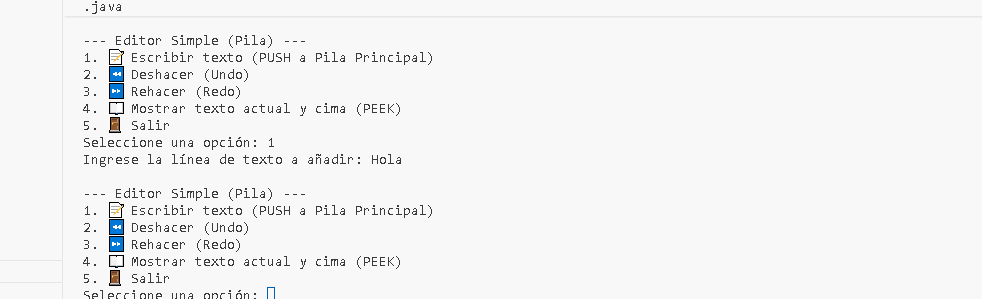
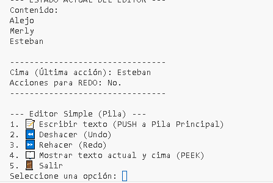
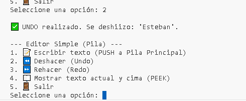
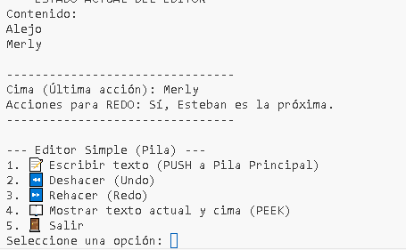
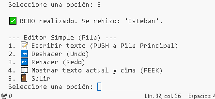
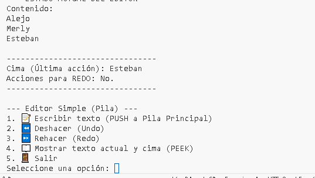

# EA2.-Actividad---Pilas-Stack-
Que el estudiante comprenda el concepto de pila y su estructura, y que sea capaz de aplicarlo en un simulador de deshacer/rehacer (Undo/Redo) en un editor de texto simple, implementado en Java, trabajando en equipo y utilizando buenas prácticas de control de versiones con GitHub.
#  Simulador de Deshacer/Rehacer (Undo/Redo) en Consola

## Objetivo del Proyecto
Implementar la estructura de datos **Pila (Stack)** de forma manual en Java para simular las funcionalidades de Deshacer (Undo) y Rehacer (Redo) en un editor de texto simple.

## Estructura de Datos
Se utilizan dos pilas:
1.  **Pila Principal:** Almacena las líneas de texto actuales.
2.  **Pila Secundaria (Redo):** Almacena las acciones deshechas.

## 🛠️ Instrucciones de Ejecución
1.  Clona el repositorio: `git clone https://www.youtube.com/watch?v=eQMcIGVc8N0`
2.  Compila los archivos Java (ej. `javac EditorConsola.java Pila.java`)
3.  Ejecuta la clase principal: `java EditorConsola`
4.  Sigue las opciones del menú.

## 📷 Capturas de Pantalla de la Ejecución
paso 1 ingreso texto 
paso 2 muestro el texto 
paso 3 ingreso otro texto

paso 4 muestro el texto 

paso 5 agrego nombres con la opcion 1 y los muestro con la opcion 4 

paso 6 uso la opcion 2 para deshacer 

paso 7 verifico si funciona la opcion 2, usando la opcion 4

Paso 8 Uso la opcion 3 para rehacer 

Paso 9 verifico si funciono la opcion 3, usando la opcion 4
##  Contribuyente
[Alejandro Jaramillo Garro]